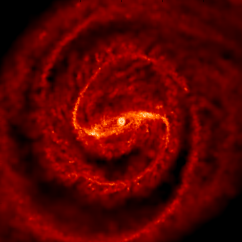

## Greetings!

Hello, I'm SungWon Kwak and study astronomy using computer simulations. You can find [my CV here](./file/CV22.pdf) for more details!

## Education
- 2022 Ph.D. (expected) Astronomy and Astrophysics, University of Rome, La Sapienza and Tor Vergata

- 2016 M.S. Astronomy, Seoul National University

- 2014 B.S. Physics & Astronomy, University of Washington

## [Research Fields](./research.html)

- Dwarf galaxies in clusters
- Galactic bar and sprial arms
- Tidal effects and galaxy mergers
- Gas effects on bar and nuclear ring
- Cluster merger effects on infalling disk galaxies (ongoing) [(movie)](https://youtu.be/AEoiyt9qSbI)
- Blue cores of dwarf galaxies in clusters (ongoing) [(movie)](https://youtu.be/n4uWMrL6USk)

## Publications
- **5.** Effects of Cluster-Group Merger on Bar Formation and Star Formation Rate of Infalling Disk Galaxies 

  - _**Kwak, SungWon**; Kim, Woong-Tae; Quinn, Thomas R. (in prep.)_

- **4.** Origin of Non-axisymmetric Features of Virgo Cluster Early-type Dwarf Galaxies – II. Tidal Effects on Disk Features and Stability

  - _**Kwak, SungWon**; Kim, Woong-Tae; Rey, Soo-Chang; & Quinn, Thomas R. (submitted to ApJ)_
  
- **3.** The Geometric Albedo of (4179) Toutatis Estimated from KMTNet DEEP-South Observation [(arXiv)](https://arxiv.org/abs/1905.08576) [(ads)](http://adsabs.harvard.edu/abs/2019arXiv190508576B)

  - _Bach, Yoonsoo P., **et al.** (accepted to JKAS)_

- **2.** Effects of Gas on Formation and Evolution of Stellar Bars and Gaseous Nuclear Rings in Disk Galaxies [(arXiv)](https://arxiv.org/abs/1901.02021) [(ads)](http://adsabs.harvard.edu/abs/2019ApJ...872....5S)

  - _Seo, Woo-Young; Kim, Woong-Tae; **Kwak, SungWon**; Hsieh, Pei-Ying; Han, Cheongho; & Hopkins, Phil F., ApJ, 872, 5 (2019)_

- **1.** Origin of Non-axisymmetric Features of Virgo Cluster Early-type Dwarf Galaxies – I. Bar Formation and Recurrent Buckling [(arXiv)](https://arxiv.org/abs/1703.10285) [(ads)](http://adsabs.harvard.edu/abs/2017ApJ...839...24K)

  - _**Kwak, SungWon**; Kim, Woong-Tae; Rey, Soo-Chang; & Kim, Suk, ApJ, 839, 24 (2017)_

