## SungWon Kwak's Homepage
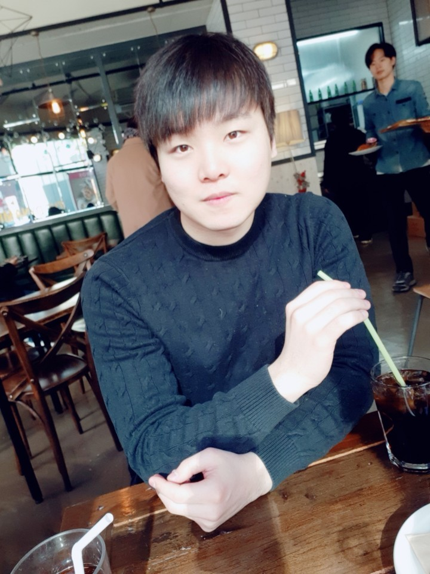 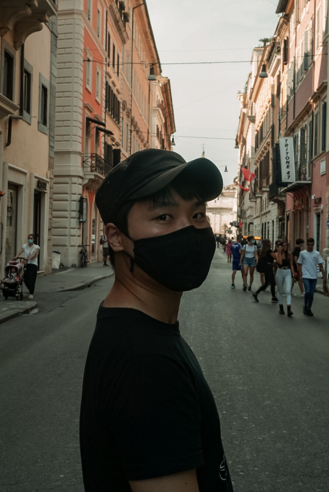 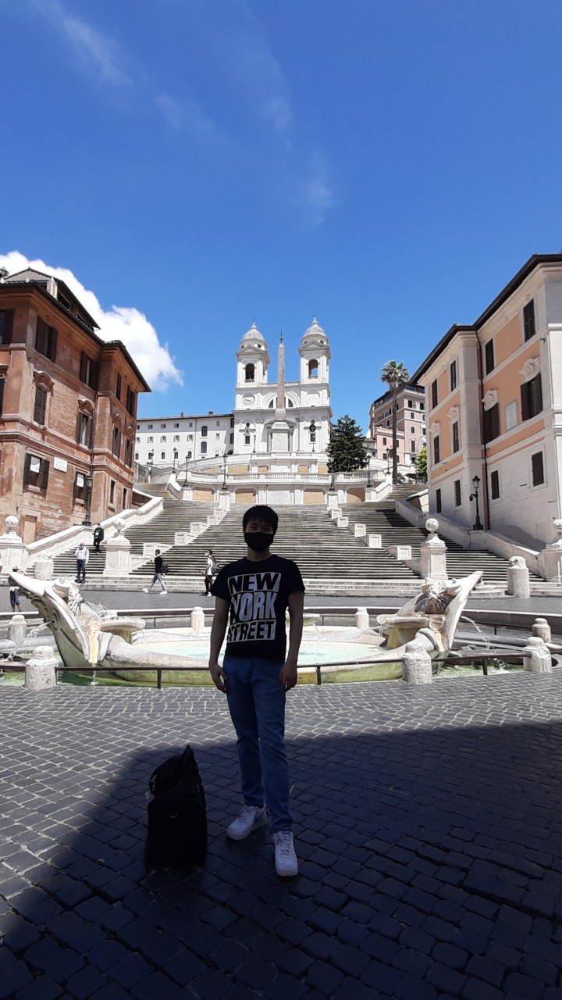 

Hello, I'm SungWon Kwak in Rome, Italy. I am a Ph.D student at the University of Rome (joint by Sapienza and Tor Vergata) and study the Galactic Halo and its formation scenario by comparing a large catalog of RR Lyrae variables (~180,000) and [the AURIGA simulations](https://wwwmpa.mpa-garching.mpg.de/auriga/). My thesis also covers several interesting numerical studies on bulge/disk regarding the metallicity gradients in nearby late-type galaxies, and on the dark matter Halo of the Milky Way regarding its size, shape, and spin axis alignment with the stellar Halo and the Bulge. You can find [my CV here](./file/CV_Kwak.pdf).

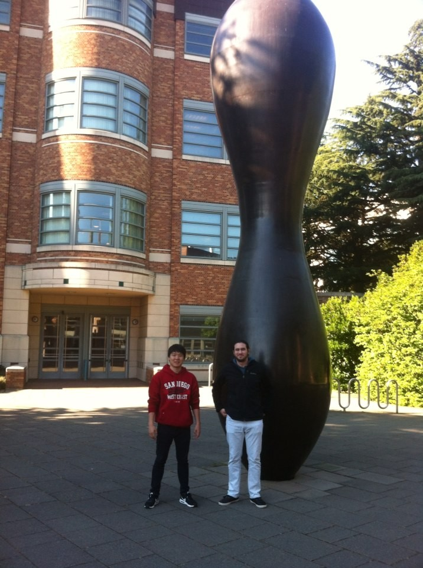 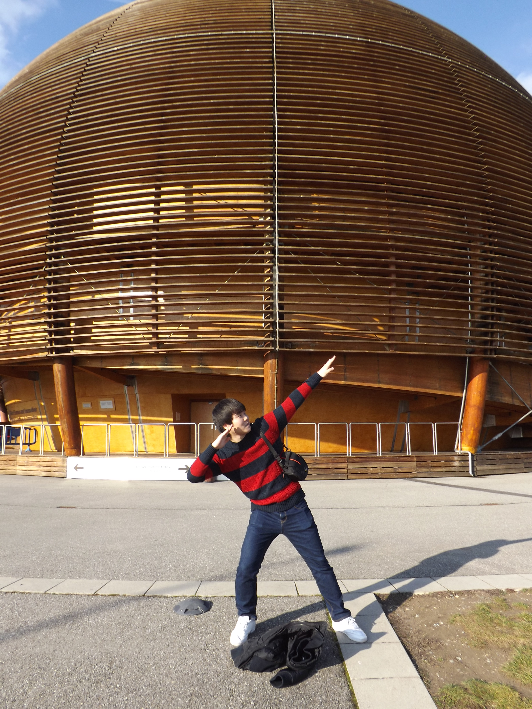 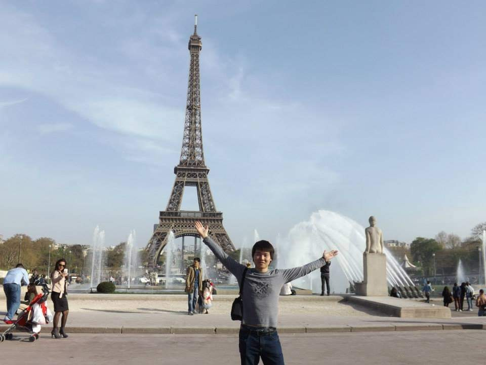

Before coming to Rome, I've been to many cities around the world. I was born in **Daejeon**, the Republic of Korea (South Korea), and my family moved to **Seoul** when I was 10. After finishing my middle school in Seoul, I went to **USA** alone to study abroad. I went to a high school in **Las Vegas** for a semester and then transferred to the Storm King high school in **New York** where I graduated from. I started my undergraduate as an engineering major, but later became more interested in the outer world, so ended up getting double degrees in astronomy and physics at the University of Washington, **Seattle**. After spending one semester in **Geneva, Switzerland** as an internship student at CERN, I did my M.S. in Astronomy at Seoul National Univeristy and spent 3 years for mandatory military service in Daejeon, Korea. Now, I'm in **Rome, Italy**, and looking for a new place to continue my study and journey. 

[My GitHub](https://github.com/swkwak) 

[ORCID](https://orcid.org/0000-0003-0957-6201): 0000-0003-0957-6201 

[Google Scholar](https://scholar.google.com/citations?user=MozW8A0AAAAJ&hl=en)

## Education/Experience
- 2019-now **Ph.D**. Astronomy & Astrophysics at the University of Rome, joint by Sapienza and Tor Vergata 
(Defense expected in Jan. 2023)

- 2016-2019 Compulsory Military Service (3 years)

- 2014-2016 **M.S.** Astronomy at Seoul National University

- Winter 2014 Internship at CERN

- 2009-2013 **B.S.** Physics & Astronomy at the University of Washington, Seattle

## [Research](./research.html)

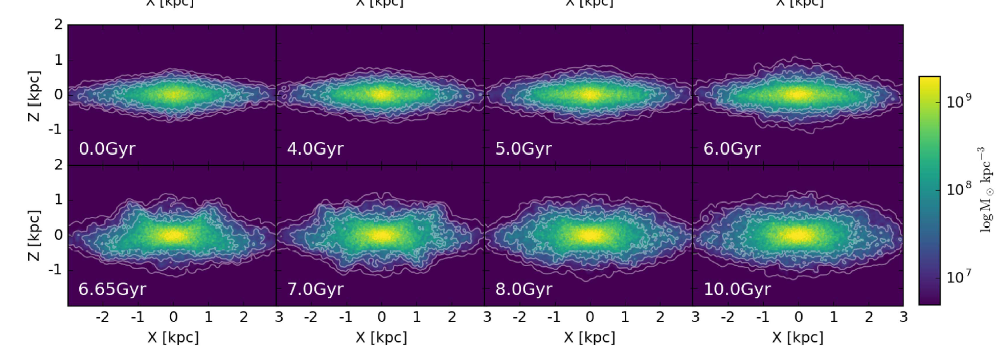 _Buckling Instability (Kwak et al. 2017)_

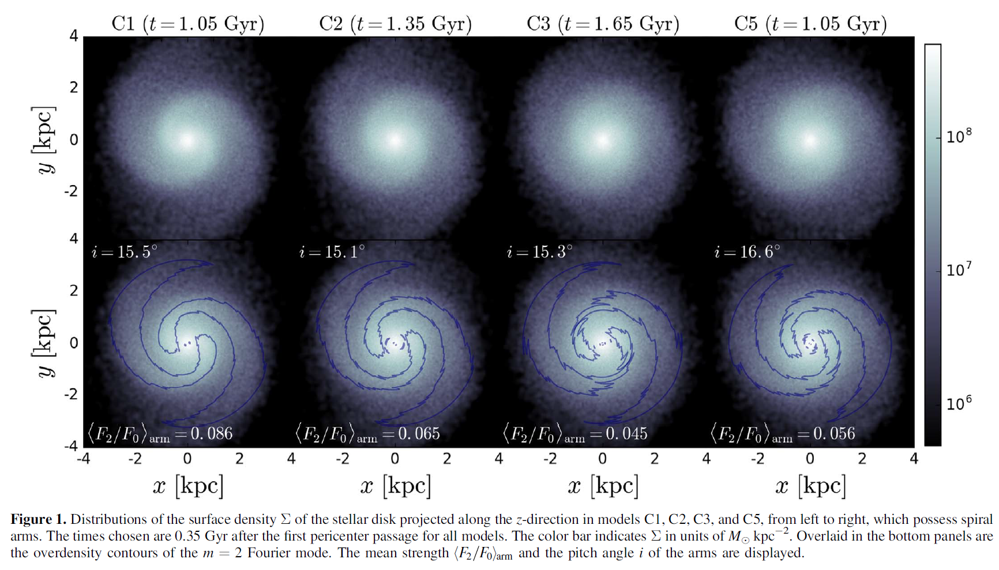 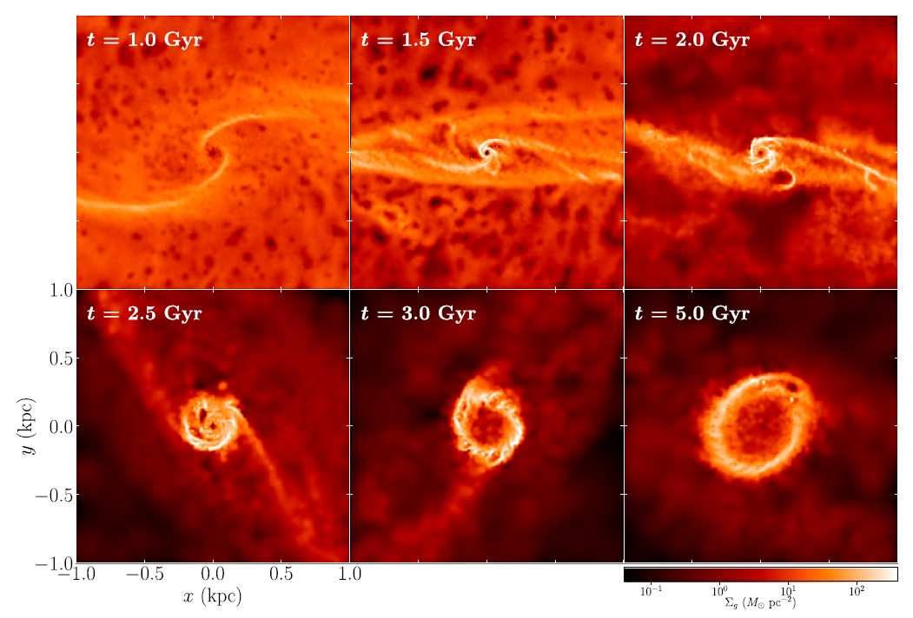 

_Faint spiral in dwarfs (Kwak et al. 2019) and Nuclear Ring (Seo et al. 2019)_ 

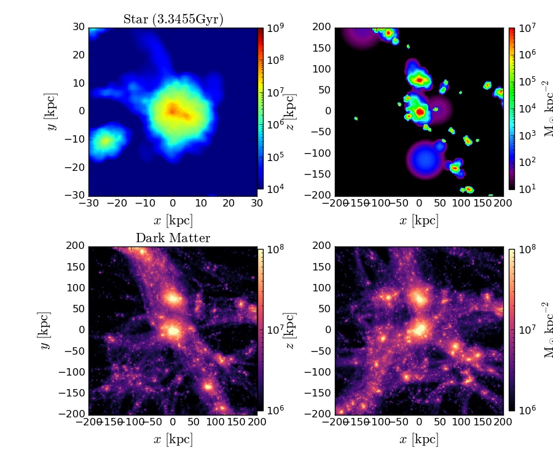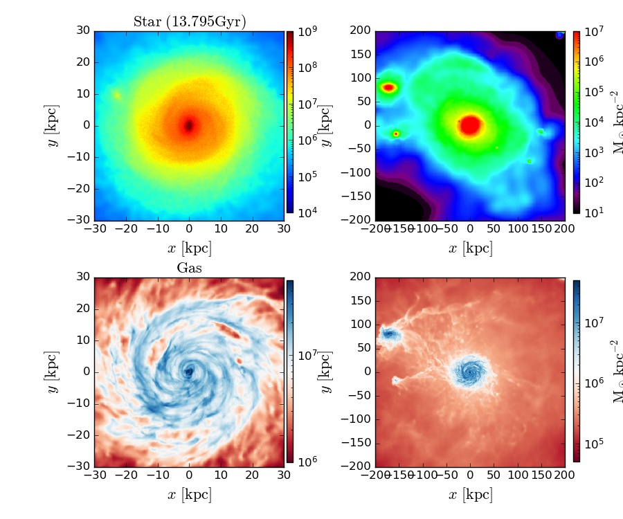 

_(the Auriga Simulations)_

**My research interests are:**
- Galaxy formation and evolution in cosmological zoom-in and isolated simulations.
- Stellar Halo: The mass distribution, chemodynamical properties, and the formation scenario.
- Bulge/Disk: Metallicity gradients and the role of the Galactic bulge.
- Dark Matter Halo: Finding evolutionary connection among Bulge, Stellar Halo, and Dark Matter Halo.
- Dwarf Galaxies in Galaxy Cluster (isolation, tidal force, and merger)
- Bar and Spiral Formation
- Buckling Instability [(movie)](https://www.youtube.com/watch?v=LZxPOnGpjvo)
- Gas effects on bar and nuclear ring
- Gaseous dwarf formation under cluster tidal force [(movie)](https://youtu.be/n4uWMrL6USk)
- Cluster merger effects on infalling disk galaxies [(movie)](https://youtu.be/AEoiyt9qSbI)

## Publications [[ADS list]](https://ui.adsabs.harvard.edu/search/fq=%7B!type%3Daqp%20v%3D%24fq_database%7D&fq_database=database%3A%20astronomy&p_=0&q=author%3A(%22kwak%2C%20sungwon%22)&sort=date%20desc%2C%20bibcode%20desc)

- **7.** The Shape of the Galactic Halo up to 150 kpc through RR Lyrae and the Auriga Simulations
  - _**Kwak, SungWon**, et al. (submitted to A&A Letter)_

- **6.** On the Use of Field, RR Lyrae as Galactic Probes. VII. Mixed mode RR Lyrae variables in Fornax and in nearby dwarf galaxies [(ads)](https://ui.adsabs.harvard.edu/abs/2022arXiv220914004B/abstract)
  - _Braga, V. F., **et al.** (accepted to MNRAS)_

- **5.** On the Use of Field RR Lyrae as Galactic Probes. V. Optical and Radial Velocity Curve Templates [(ads)](https://ui.adsabs.harvard.edu/abs/2021ApJ...919...85B/abstract)
  - _Braga, V. F., **et al.**, APJ, 919, 85B (2021)_

- **4.** Origin of Non-axisymmetric Features of Virgo Cluster Early-type Dwarf Galaxies – II. Tidal Effects on Disk Features and Stability [(ads)](https://ui.adsabs.harvard.edu/abs/2019ApJ...887..139K/abstract)

  - _**Kwak, SungWon**; Kim, Woong-Tae; Rey, Soo-Chang; & Quinn, Thomas R., ApJ, 887, 139K (2019)_
  
- **3.** The Geometric Albedo of (4179) Toutatis Estimated from KMTNet DEEP-South Observation [(ads)](https://ui.adsabs.harvard.edu/abs/2019JKAS...52...71B/abstract)

  - _Bach, Yoonsoo P., **et al.**, JKAS, 52, 71B (2019)_ 

- **2.** Effects of Gas on Formation and Evolution of Stellar Bars and Gaseous Nuclear Rings in Disk Galaxies [(ads)](http://adsabs.harvard.edu/abs/2019ApJ...872....5S)

  - _Seo, Woo-Young; Kim, Woong-Tae; **Kwak, SungWon**; Hsieh, Pei-Ying; Han, Cheongho; & Hopkins, Phil F., ApJ, 872, 5 (2019)_

- **1.** Origin of Non-axisymmetric Features of Virgo Cluster Early-type Dwarf Galaxies – I. Bar Formation and Recurrent Buckling [(ads)](http://adsabs.harvard.edu/abs/2017ApJ...839...24K)

  - _**Kwak, SungWon**; Kim, Woong-Tae; Rey, Soo-Chang; & Kim, Suk, ApJ, 839, 24 (2017)_

(Last updated in Sept. 2022)
