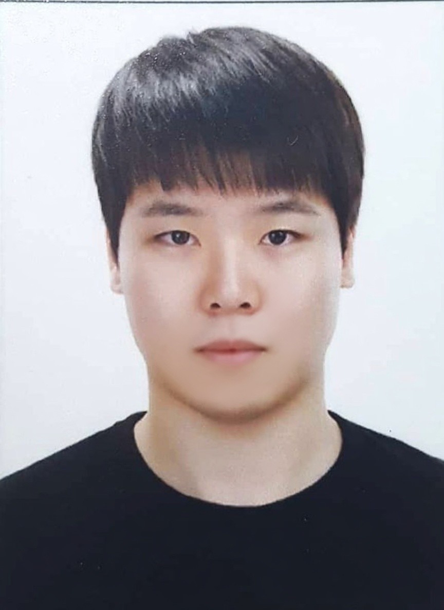
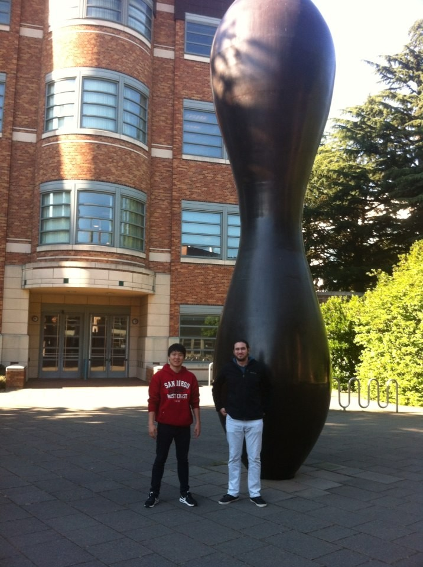
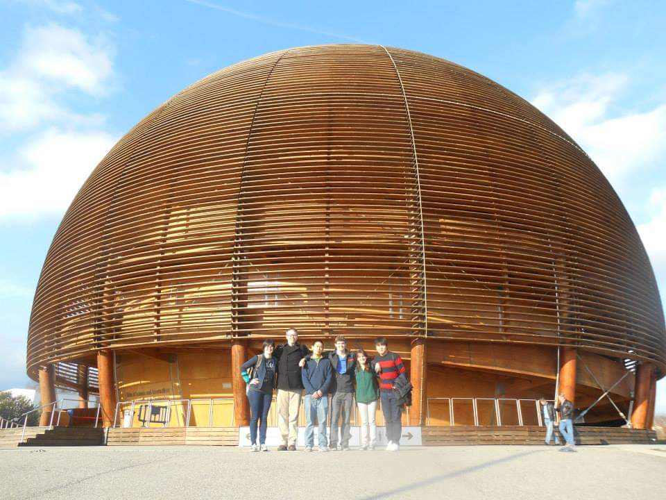
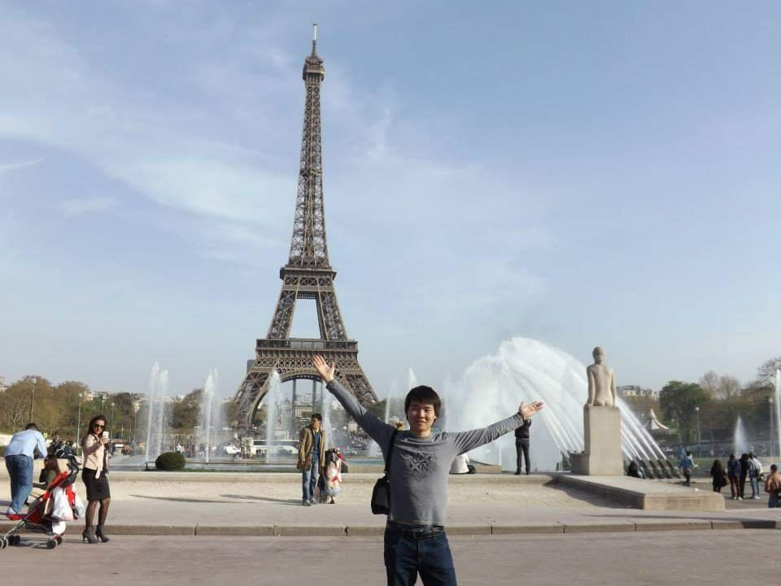
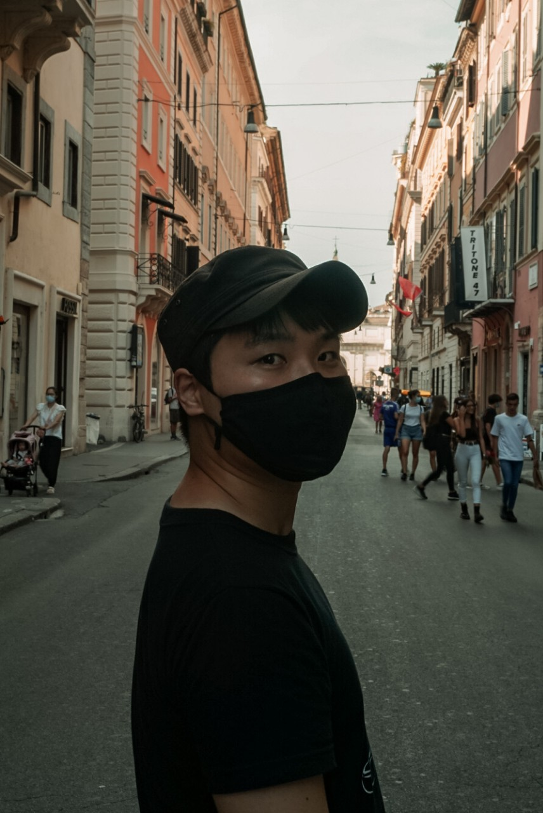
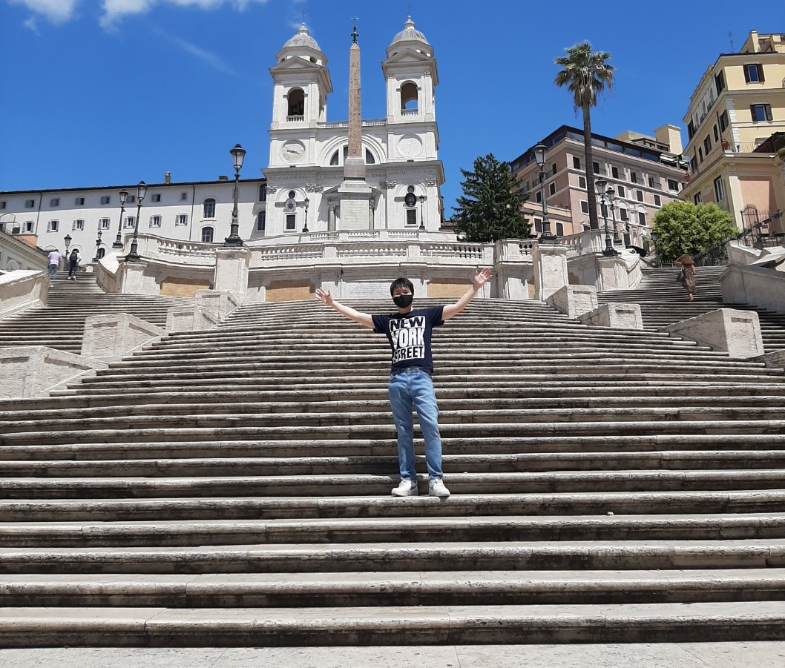
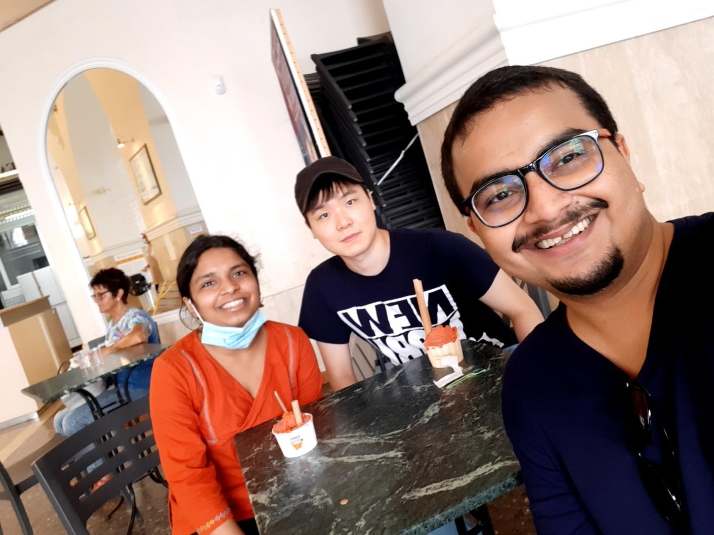

## SungWon Kwak's Homepage
  

_(Last updated in Sept. 2026)_

Hi, I'm an astrophysicist at Leibniz Institute for Astrophysics Potsdam in Germany.
I mainly use numerical simulations to understand the formation and evolution of galaxies and their substructures.
Currently, I'm leading the SMUGGLE-Ring project [press release](https://www.aip.de/en/news/galactic-structures-grow-together/), which aims to understand the formation and evolution of nuclear disk, nuclear ring and nuclear star cluster in barred galaxies.

[Download CV (pdf)](./file/CV__Curriculum_Vitae__SungWon_Kwak.pdf)

[ADS publication](https://ui.adsabs.harvard.edu/search/fq=%7B!type%3Daqp%20v%3D%24fq_database%7D&fq_database=database%3A%20astronomy&q=author%3A(%22kwak%2C%20sungwon%22)&sort=date%20desc%2C%20bibcode%20desc&p_=0)

[ORCID](https://orcid.org/0000-0003-0957-6201): 0000-0003-0957-6201

## Short Bio
    
 
    

 
Before coming to Potsdam in Germany, I had lived in many cities around the world. I was born in **Daejeon**, South Korea, and my family moved to **Seoul** when I was 10. After finishing middle school in Seoul, I went to the USA alone to study abroad. I went to a high school in **Las Vegas** for one semester and then transferred to The Storm King School in **New York**, where I graduated. I started my undergraduate studies as an engineering major, but later became more interested in the universe, so I ended up completing a double major in astronomy and physics at the University of Washington, **Seattle**. After spending one semester in **Geneva**, Switzerland (St.Genis, France) as an intern at CERN, I obtained an M.S. in Astronomy from Seoul National University and spent three years completing mandatory military service in Daejeon, Korea. My Ph.D. studies in Astronomy and Astrophysics were conducted at the University of **Rome**, Italy during the pandemic, and the dissertation was completed in March 2023. 

## Education/Employment
- 2023.09-_present_ **Postdoc** the Leibniz-Institute for Astrophysics Potsdam, Germany

- 2023.06-08 **Postdoc** Seoul National University, Korea

- 2019-2022 **Ph.D**. Astronomy & Astrophysics at the University of Rome, joint by Sapienza and Tor Vergata, Italy 
_(Dissertation in 2023.03)_

- 2016-2019 Technical Research Personnel (mandatory military service)

- 2014-2016 **M.S.** Astronomy at Seoul National University, Korea

- Winter 2014 Research Intern with Scholarship at CERN, Switzerland

- 2009-2013 **B.S.** Physics & Astronomy at the University of Washington, Seattle, USA

- 2007-2009 Storm King High School, New York, USA

